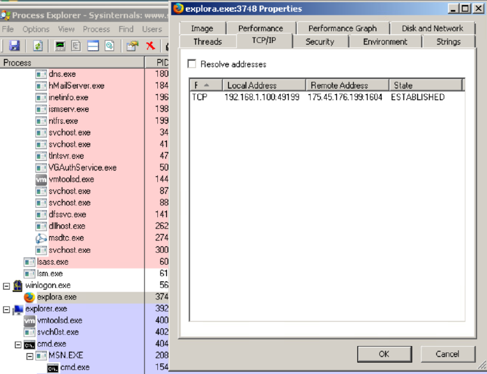
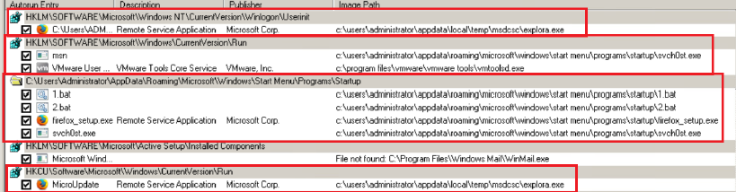
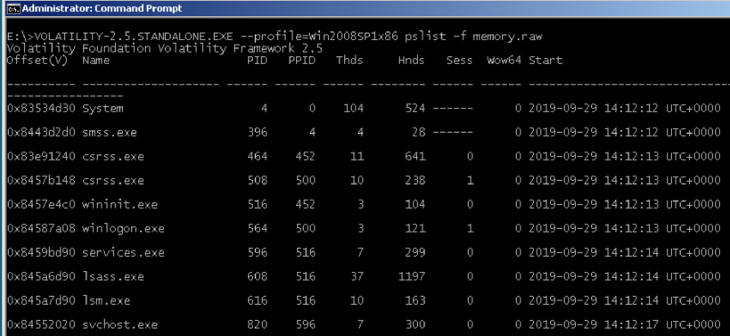
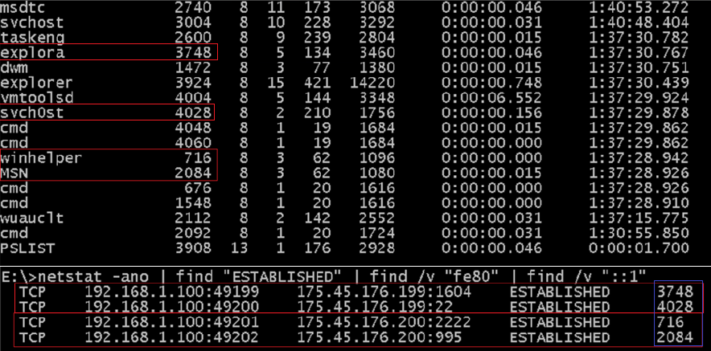
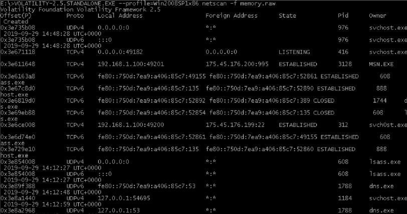
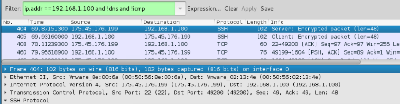

# SOC Incident Investigation: Compromised Windows Host Analysis

## Overview

This hands-on SOC investigation project simulates the analysis of a compromised Windows system in a controlled lab environment.

The investigation focused on identifying indicators of compromise (IOCs), analyzing suspicious processes and network connections, reviewing persistence mechanisms, and documenting incident response findings using multiple forensic and monitoring tools.

---

## Objectives

* Investigate indicators of compromise (IOCs)
* Analyze suspicious processes and network connections
* Review Windows and Linux log artifacts
* Examine persistence mechanisms
* Perform memory and packet analysis
* Document investigation findings and remediation recommendations

---

## Tools Used

| Tool             | Purpose                              |
| ---------------- | ------------------------------------ |
| Splunk           | Log analysis and event investigation |
| Wireshark        | Packet and traffic analysis          |
| NetworkMiner     | Network artifact analysis            |
| Process Explorer | Process and TCP/IP analysis          |
| Autoruns         | Persistence investigation            |
| Netstat          | Connection analysis                  |
| Volatility       | Memory analysis                      |
| Nmap             | Network discovery                    |
| OpenVAS          | Vulnerability analysis               |
| Autopsy          | Digital forensics workflow           |
| Kali Linux       | Investigation platform               |

---

## Investigation Scope

### 1. Network Compromise Investigation

* Volatile data collection
* RAM acquisition and analysis
* Scheduled task investigation
* Service analysis
* File artifact investigation

### 2. Malicious Indicator Discovery

* Process analysis
* Suspicious connection analysis
* Registry persistence investigation
* IOC identification

### 3. Log Analysis and Threat Hunting

* Linux authentication logs
* Apache access logs
* Splunk investigation workflows
* Authentication event analysis

### 4. Packet and Traffic Analysis

* Protocol analysis
* Packet inspection
* SSH traffic analysis
* Network artifact correlation

### 5. Digital Forensics Workflow

* Evidence handling
* Forensic reporting
* Chain of custody concepts
* Autopsy investigation basics

---

# Investigation Evidence

## Process Investigation

### Process Explorer TCP/IP Analysis

The investigation identified suspicious outbound network connections associated with active processes. Process Explorer was used to correlate running processes with active TCP/IP connections and identify unusual remote communication.

---

### Persistence Mechanism Analysis

Autoruns was used to identify suspicious startup persistence entries and unauthorized application execution paths commonly associated with attacker persistence techniques.

---

### Memory Process Analysis

Volatility Framework was used to review running processes from a memory image and identify potentially suspicious activity within system memory artifacts.

---

# Network Investigation

### Suspicious Network Connections

Netstat analysis identified active established connections and associated process identifiers (PIDs), helping correlate suspicious communication with running processes.

---

### Memory-Based Network Analysis

Volatility netscan analysis was performed to identify active and historical network connections from memory artifacts.

---

### Packet and Traffic Analysis

Wireshark was used to inspect network traffic, review SSH communication, and analyze packet-level activity associated with suspicious connections.

---

# Security Recommendations

Based on the investigation findings, the following remediation and hardening actions are recommended:

* Investigate suspicious outbound network communication
* Review and disable unauthorized startup persistence entries
* Perform malware scanning and forensic validation
* Restrict unnecessary outbound connections
* Monitor network traffic for unusual SSH communication
* Improve endpoint logging and centralized monitoring
* Review process execution and startup behavior
* Apply security patches and endpoint hardening controls
* Implement SIEM alerting for suspicious process and connection activity
* Perform continuous log monitoring and threat hunting activities

---

# IOC Summary

| Indicator      | Type                          |
| -------------- | ----------------------------- |
| svch0st.exe    | Suspicious Process            |
| explora.exe    | Suspicious Executable         |
| 175.45.176.199 | External IP Address           |
| 175.45.176.200 | External IP Address           |
| Port 2222      | Suspicious Network Connection |
| Port 995       | Suspicious Network Connection |

---

# MITRE ATT&CK Techniques Observed

| Technique                                    | Description                                  |
| -------------------------------------------- | -------------------------------------------- |
| T1053 - Scheduled Task/Job                   | Persistence through scheduled task execution |
| T1547 - Boot or Logon Autostart Execution    | Startup persistence mechanisms               |
| T1049 - System Network Connections Discovery | Active connection analysis                   |
| T1057 - Process Discovery                    | Running process investigation                |
| T1046 - Network Service Discovery            | Network and port analysis                    |
| T1040 - Network Sniffing                     | Packet capture and traffic inspection        |
| T1105 - Ingress Tool Transfer                | Suspicious outbound communication activity   |

---

## Analysis Summary

The investigation identified multiple indicators of compromise across process execution, memory artifacts, persistence mechanisms, and network communications.

Correlating host-based artifacts with network activity improved visibility into suspicious behavior and persistence techniques commonly associated with post-compromise activity.

The investigation demonstrates how endpoint visibility, memory analysis, and network traffic inspection can support SOC investigations and incident response workflows.

---

# Disclaimer

All activities, investigations, and analysis included in this repository were performed in authorized and controlled lab environments for educational and defensive security purposes only.
